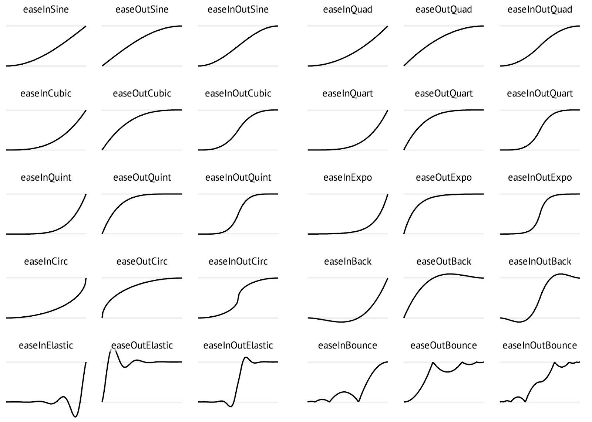

CS4730 - HW 4: Camera and Tweening
===============================

Github Assignment Link
---------------------------------------

Every assignment has a **Github Classroom Link** you must follow to get the starter code (if applicable) and to create your repository for the assignment. If you haven't yet done so, follow the instructions at the [Github Classroom Tutorial](./githubclassroom.html).

**Assignment Invite Link**: COMING SOON

Once your repository is configured, push your code to it in order to submit your work.

Background and Tutorials
---------------------------------------

In this assignment, we will begin by looking at simple camera controls in Unity. You will learn how to setup a camera and have it follow a character around the screen. You will also use investigate some simple techniques for setting up parallax layers.

You will also learn a bit about *tweening*. Tweening is an effect in which the start and end points of a simple animation are defined and all of the states in between those points are calculated and animated on the fly.

You should look over / use these resources while working on this assignment:

- [Camera documentation](https://docs.unity3d.com/Manual/class-Camera.html)
- [2D Sorting](https://docs.unity3d.com/Manual/2DSorting.html)
- [Easings](https://easings.net/)

Required Features (3 features. 3/3 to pass)
---------------------------------------

When you clone the repo, there will be a Unity project already present for you to start from. Your submission / demo must have the following required features added to that project:

- **Camera Controller**
    - Open the “Camera” scene. Sayu (that is here name I suppose) will automatically begin moving to random positions when you press play.
    - Modify the CameraController.cs script to smoothly follow the player
      - May not simply make the camera a child of the player. Must have smoothing
      - Ensure that the player is always in view, even at high speeds
- **Basic Tweening System**
    - Modify the Tween.cs script
      - In it, you will see a switch statement containing most of the commonly used easing functions
      - Implement one easing function of each type (Sine, Quad, Cubic, Quart, Quint, Expo, Circ, Back, Elastic, and Bounce)
      - Linear doesn't count.
      - { width=70% }
    - Open the “Tweening” scene
      - Select BallManager GameObject and in the inspector select a ball sprite of your choice.
      - Select the Ball component of each of the four balls and select a different easing function and duration for each.
- **Parallax**
  - Open the “Parallax” scene
  - Implement parallaxing in the `Parallax.cs` script based on some depth (recommended to use z position as a function of material offset)
  - Take one of the background and foreground assets and have them parallax - 
  - Set up a background and foreground sorting layer and place objects in the appropriate sorting layer.

Optional Features
---------------------------------------

You can obtain the following optional points on this assignment:

- **Camera leading (1 point)**
  - Bias the camera towards the player’s velocity
- **Separate background and foreground into their own cameras (2 points)**
  - Cameras can be set up to only display certain layers. Set up one camera for foreground elements and one for background elements.
  - This allows you to place the background elements elsewhere, at any scale, independent of the player camera, which is much cleaner and less obtrusive.
- **Moving parallax elements (1 point)**
  - Allow certain objects (like clouds) to move independently through the background, adding onto the existing parallax movement.
- **Complete the easing functions (1 point)**
  - Implement the easing functions you skipped over previously.
  - 3 for each type (In, Out, and InOut) 
- **Expanded tweening library (2 points)**
  - Add functionality for automatically lerping floats
    - In other words, the actual lerping should be done in the `ExecuteCoroutine` function in Tween.cs
  - Add functionality for automatically lerping Vector3s and/or Vector2s
    - You will either need to modify the `ExecuteCoroutine` signature or make another one.

